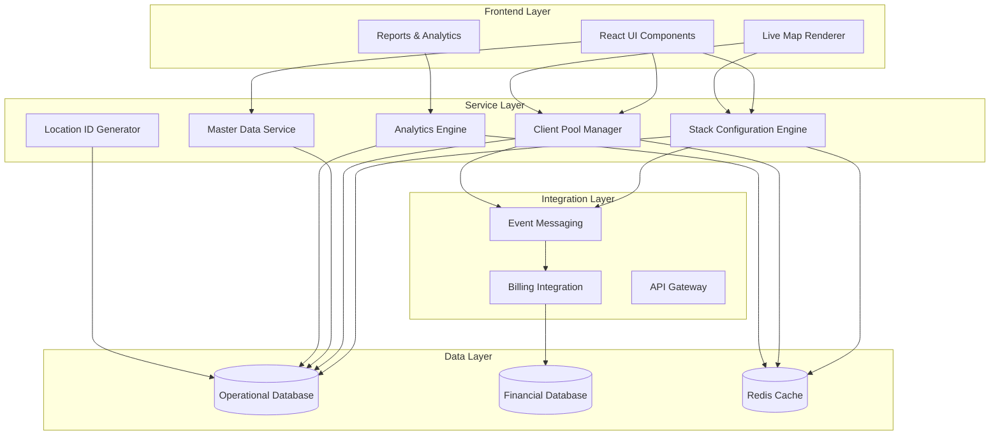

# Comprehensive Yard Management System Design

## Overview

The Comprehensive Yard Management System is designed as a modular, service-oriented architecture that enhances the existing container depot management system. The design focuses on separation of concerns, scalability, and maintainability while providing advanced operational capabilities.

The system consists of eight core services that work together to provide comprehensive yard management capabilities while maintaining clear boundaries between operational and financial concerns.

## Architecture

### High-Level Architecture



### Service Architecture Principles

1. **Separation of Concerns**: Operational and financial data are completely separated
2. **Event-Driven Communication**: Services communicate through events for loose coupling
3. **Caching Strategy**: Frequently accessed data is cached for performance
4. **API-First Design**: All services expose well-defined APIs
5. **Audit Trail**: All operations are logged for compliance and debugging

## Components and Interfaces

### 1. Stack Configuration Engine

**Purpose**: Manages stack layouts, capacity calculations, and container size assignments

**Key Responsibilities**:
- Stack creation, modification, and deletion
- 40ft container pairing logic and validation
- Virtual stack mapping for paired configurations
- Capacity calculations based on container size
- Stack optimization recommendations

**API Endpoints**:
```typescript
interface StackConfigurationAPI {
  createStack(stackData: StackCreateRequest): Promise<YardStack>
  updateStackSize(stackId: string, containerSize: '20feet' | '40feet'): Promise<YardStack[]>
  validateStackPairing(stackNumber: number): Promise<PairingValidation>
  getStackRecommendations(criteria: OptimizationCriteria): Promise<StackRecommendation[]>
  bulkUpdateStacks(updates: BulkStackUpdate[]): Promise<BulkOperationResult>
}
```

**Data Models**:
```typescript
interface YardStack {
  id: string
  yardId: string
  stackNumber: number
  sectionId: string
  sectionName: string
  rows: number
  maxTiers: number
  capacity: number
  currentOccupancy: number
  containerSize: '20feet' | '40feet'
  position: Position3D
  dimensions: Dimensions
  isActive: boolean
  isSpecialStack: boolean
  pairedWith?: number
  assignedClientCode?: string
  notes?: string
  createdAt: Date
  updatedAt: Date
  createdBy: string
  updatedBy?: string
}
```

### 2. Client Pool Manager

**Purpose**: Manages client-specific stack assignments and capacity allocation

**Key Responsibilities**:
- Client pool creation and management
- Stack assignment optimization
- Utilization tracking and reporting
- Overflow management and recommendations
- Bulk assignment operations

**API Endpoints**:
```typescript
interface ClientPoolAPI {
  createClientPool(poolData: ClientPoolCreateRequest): Promise<ClientPool>
  assignStacksToClient(clientCode: string, stackIds: string[]): Promise<AssignmentResult>
  bulkAssignStacks(assignments: BulkAssignment[]): Promise<BulkOperationResult>
  getUtilizationReport(clientCode?: string): Promise<UtilizationReport>
  getOptimalAssignment(request: AssignmentRequest): Promise<AssignmentRecommendation>
  handleOverflow(clientCode: string): Promise<OverflowRecommendation>
}
```

### 3. Master Data Service

**Purpose**: Manages operational client data separate from financial information

**Key Responsibilities**:
- Client operational information management
- Contact and preference management
- Client hierarchy and relationships
- Operational audit trails
- Data synchronization with external systems

**API Endpoints**:
```typescript
interface MasterDataAPI {
  createClient(clientData: OperationalClientData): Promise<OperationalClient>
  updateClient(clientId: string, updates: ClientUpdateData): Promise<OperationalClient>
  getClient(clientId: string): Promise<OperationalClient>
  searchClients(criteria: SearchCriteria): Promise<OperationalClient[]>
  getClientHierarchy(parentId: string): Promise<ClientHierarchy>
}
```

**Data Models**:
```typescript
interface OperationalClient {
  id: string
  code: string
  name: string
  email: string
  phone: string
  address: Address
  contactPerson: ContactPerson
  operationalPreferences: OperationalPreferences
  serviceRequirements: ServiceRequirement[]
  isActive: boolean
  parentClientId?: string
  createdAt: Date
  updatedAt: Date
  // Financial data explicitly excluded
}
```

### 4. Analytics Engine

**Purpose**: Provides operational insights, predictive analytics, and performance metrics

**Key Responsibilities**:
- Real-time operational dashboards
- Predictive analytics and forecasting
- Performance metric calculations
- Exception detection and alerting
- Multi-yard comparative analytics

**API Endpoints**:
```typescript
interface AnalyticsAPI {
  getDashboardMetrics(yardId?: string): Promise<DashboardMetrics>
  getOperationalReport(criteria: ReportCriteria): Promise<OperationalReport>
  getPredictiveAnalytics(type: AnalyticsType): Promise<PredictiveInsights>
  getPerformanceMetrics(timeRange: TimeRange): Promise<PerformanceMetrics>
  getAnomalyDetection(yardId: string): Promise<AnomalyReport>
}
```

### 5. Location ID Generator

**Purpose**: Generates and validates location identifiers in SXXRXHX format

**Key Responsibilities**:
- Location ID generation and validation
- Format consistency enforcement
- Bulk location generation for stacks
- Location mapping and translation

**API Endpoints**:
```typescript
interface LocationIDAPI {
  generateLocationId(stackNumber: number, row: number, height: number): string
  validateLocationId(locationId: string): ValidationResult
  generateStackLocations(stackConfig: StackConfiguration): string[]
  parseLocationId(locationId: string): LocationComponents
}
```

### 6. Live Map Renderer

**Purpose**: Provides real-time yard visualization with advanced interaction capabilities

**Key Responsibilities**:
- Real-time yard visualization
- Container search and highlighting
- Interactive filtering and navigation
- Performance optimization for large datasets
- Custom view configurations

**Component Architecture**:
```typescript
interface LiveMapRenderer {
  // Core rendering
  renderYardLayout(yard: Yard, containers: Container[]): void
  updateContainerPositions(updates: ContainerUpdate[]): void
  
  // Search and filtering
  searchContainers(query: string): Container[]
  applyFilters(filters: MapFilter[]): void
  highlightContainers(containerIds: string[]): void
  
  // Performance optimization
  enableVirtualization(enabled: boolean): void
  setRenderingMode(mode: 'full' | 'optimized'): void
  
  // User interactions
  onContainerClick(handler: (container: Container) => void): void
  onStackClick(handler: (stack: YardStack) => void): void
  saveViewConfiguration(name: string): void
}
```

### 7. Billing Integration Service

**Purpose**: Handles financial calculations while maintaining separation from operational data

**Key Responsibilities**:
- Financial data management in separate database
- Billing calculations using operational events
- Revenue reporting and analytics
- Secure integration with operational systems

**API Endpoints**:
```typescript
interface BillingIntegrationAPI {
  calculateCharges(operationalData: OperationalEvent[]): Promise<BillingCalculation>
  getRevenueReport(criteria: RevenueCriteria): Promise<RevenueReport>
  processOperationalEvent(event: OperationalEvent): Promise<void>
  getClientFinancialSummary(clientCode: string): Promise<FinancialSummary>
}
```

### 8. Event Messaging System

**Purpose**: Provides reliable event-driven communication between services

**Key Responsibilities**:
- Event publishing and subscription
- Message routing and delivery
- Event persistence and replay
- Dead letter queue management

## Data Models

### Core Operational Models

```typescript
interface OperationalEvent {
  id: string
  eventType: 'container_gate_in' | 'container_gate_out' | 'container_move' | 'stack_assignment'
  yardId: string
  containerId?: string
  stackId?: string
  clientCode?: string
  timestamp: Date
  operatorId: string
  metadata: Record<string, any>
}

interface UtilizationMetrics {
  clientCode: string
  assignedStacks: number
  totalCapacity: number
  currentOccupancy: number
  utilizationRate: number
  averageDwellTime: number
  peakUtilization: number
  recommendations: string[]
}

interface PerformanceMetrics {
  yardId: string
  timeRange: TimeRange
  gateProcessingTime: {
    average: number
    median: number
    p95: number
  }
  containerDwellTime: {
    average: number
    median: number
    byClient: Record<string, number>
  }
  equipmentUtilization: {
    cranes: number
    forklifts: number
    trucks: number
  }
  operatorEfficiency: Record<string, number>
}
```

## Error Handling

### Error Categories

1. **Validation Errors**: Invalid input data or business rule violations
2. **Conflict Errors**: Resource conflicts (e.g., stack already assigned)
3. **System Errors**: Database connectivity, service unavailability
4. **Integration Errors**: External system communication failures

### Error Response Format

```typescript
interface ErrorResponse {
  code: string
  message: string
  details?: Record<string, any>
  timestamp: Date
  requestId: string
  suggestions?: string[]
}
```

### Retry and Recovery Strategies

- **Transient Errors**: Automatic retry with exponential backoff
- **Conflict Errors**: User notification with alternative suggestions
- **System Errors**: Circuit breaker pattern with fallback responses
- **Data Consistency**: Event sourcing with compensation patterns

## Testing Strategy

### Unit Testing
- Service logic testing with mocked dependencies
- Data model validation testing
- Algorithm testing for optimization functions
- Error handling and edge case testing

### Integration Testing
- API endpoint testing with real database
- Event messaging flow testing
- Cross-service communication testing
- Performance testing under load

### End-to-End Testing
- Complete user workflow testing
- Multi-yard operation testing
- Bulk operation testing
- Disaster recovery testing

### Performance Testing
- Load testing for concurrent users
- Stress testing for peak capacity
- Memory and CPU profiling
- Database query optimization

## Security Considerations

### Data Protection
- Operational and financial data separation
- Role-based access control (RBAC)
- API authentication and authorization
- Data encryption at rest and in transit

### Audit and Compliance
- Complete audit trails for all operations
- Immutable event logs
- Compliance reporting capabilities
- Data retention policies

### Integration Security
- Secure API keys and tokens
- Network segmentation
- Rate limiting and throttling
- Input validation and sanitization 