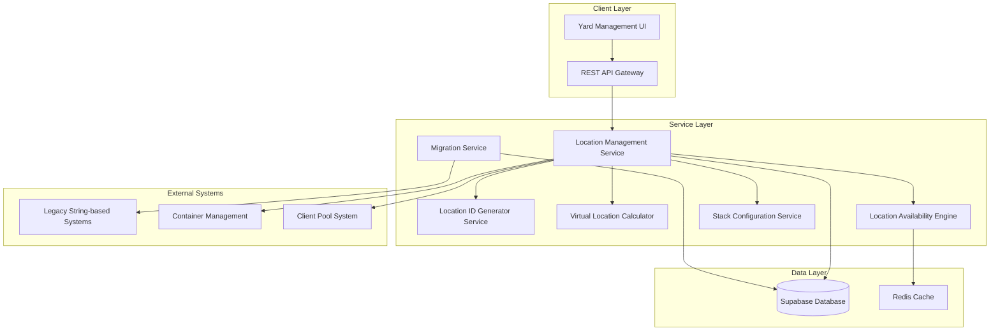

# Database Location Management System Design

## Overview

The Database Location Management System transforms the current string-based stack ID approach into a comprehensive UUID-based database solution. This system provides automatic location ID generation, virtual location calculations for 40ft containers, real-time availability tracking, and seamless integration with existing yard operations.

The design prioritizes data integrity, performance, and backward compatibility while establishing a foundation for scalable yard management operations.

## Architecture

### System Components



### Database Architecture

The system uses Supabase PostgreSQL with the following key architectural decisions:

- **UUID Primary Keys**: All entities use UUIDs for distributed system compatibility
- **Row Level Security (RLS)**: Client pool isolation enforced at database level
- **Audit Logging**: Comprehensive change tracking using database triggers
- **Indexing Strategy**: Optimized for location queries and availability lookups

## Components and Interfaces

### 1. Location Management Service (Core Orchestrator)

**Responsibilities:**
- Coordinates all location-related operations
- Provides unified API for location queries and updates
- Manages transaction boundaries across services

**Key Interfaces:**
```typescript
interface LocationManagementService {
  createStack(config: StackConfiguration): Promise<Stack>
  updateStackConfiguration(stackId: string, config: StackConfiguration): Promise<void>
  getAvailableLocations(criteria: LocationCriteria): Promise<Location[]>
  assignContainer(locationId: string, containerId: string): Promise<void>
  releaseLocation(locationId: string): Promise<void>
  searchLocations(query: LocationQuery): Promise<Location[]>
}
```

### 2. Location ID Generator Service

**Design Rationale:** Centralized ID generation ensures consistency and prevents conflicts across distributed operations.

**Responsibilities:**
- Generates location IDs in SXXRXHX format
- Maintains ID uniqueness across the yard
- Handles bulk location creation for new stacks

**Algorithm:**
- Stack number: Zero-padded to 2 digits (S01, S02, etc.)
- Row number: Single digit (R1, R2, etc.)
- Tier number: Single digit (H1, H2, etc.)
- Format validation: Regex pattern `^S\d{2}R\d{1}H\d{1}$`

### 3. Virtual Location Calculator

**Design Rationale:** 40ft containers require special handling as they span two physical stacks. Virtual locations provide a unified view while maintaining physical stack references.

**Responsibilities:**
- Calculates virtual stack numbers using MIN(stack1, stack2) + 1
- Maintains bidirectional mapping between virtual and physical locations
- Handles virtual location cleanup when stack pairing changes

**Virtual Location Logic:**
```typescript
interface VirtualLocationCalculator {
  calculateVirtualStack(stack1: number, stack2: number): number
  createVirtualLocations(pairedStacks: StackPair): Promise<VirtualLocation[]>
  updateVirtualLocations(stackPairId: string): Promise<void>
  cleanupVirtualLocations(stackPairId: string): Promise<void>
}
```

### 4. Location Availability Engine

**Design Rationale:** Real-time availability tracking is critical for operational efficiency. Redis caching provides sub-second response times for availability queries.

**Responsibilities:**
- Tracks real-time location occupancy
- Provides filtered availability queries
- Maintains availability cache for performance
- Handles client pool access restrictions

**Caching Strategy:**
- Redis cache for hot availability data
- Cache invalidation on occupancy changes
- Fallback to database for cache misses
- TTL-based cache refresh for data consistency

### 5. Stack Configuration Service

**Design Rationale:** Stack configuration changes must be atomic and validated to prevent data inconsistency.

**Responsibilities:**
- Manages stack parameters (rows, tiers, container sizes)
- Validates configuration changes against existing assignments
- Triggers location record updates
- Provides transaction rollback capabilities

### 6. Migration Service

**Design Rationale:** Backward compatibility is essential during the transition period. The service provides translation layers and validation to ensure seamless migration.

**Responsibilities:**
- Migrates string-based IDs to UUID records
- Provides API compatibility layers
- Validates data integrity during migration
- Generates migration reports and error handling

## Data Models

### Core Entities

```sql
-- Stacks table
CREATE TABLE stacks (
    id UUID PRIMARY KEY DEFAULT gen_random_uuid(),
    stack_number INTEGER NOT NULL UNIQUE,
    section_id UUID REFERENCES sections(id),
    rows INTEGER NOT NULL CHECK (rows > 0),
    tiers INTEGER NOT NULL CHECK (tiers > 0),
    container_size container_size_enum NOT NULL,
    is_active BOOLEAN DEFAULT true,
    created_at TIMESTAMPTZ DEFAULT NOW(),
    updated_at TIMESTAMPTZ DEFAULT NOW()
);

-- Locations table
CREATE TABLE locations (
    id UUID PRIMARY KEY DEFAULT gen_random_uuid(),
    location_id VARCHAR(8) NOT NULL UNIQUE, -- SXXRXHX format
    stack_id UUID NOT NULL REFERENCES stacks(id),
    row_number INTEGER NOT NULL,
    tier_number INTEGER NOT NULL,
    is_virtual BOOLEAN DEFAULT false,
    virtual_stack_pair_id UUID REFERENCES virtual_stack_pairs(id),
    is_occupied BOOLEAN DEFAULT false,
    container_id UUID REFERENCES containers(id),
    client_pool_id UUID REFERENCES client_pools(id),
    created_at TIMESTAMPTZ DEFAULT NOW(),
    updated_at TIMESTAMPTZ DEFAULT NOW(),
    
    CONSTRAINT valid_location_id CHECK (location_id ~ '^S\d{2}R\d{1}H\d{1}$'),
    CONSTRAINT unique_stack_position UNIQUE (stack_id, row_number, tier_number)
);

-- Virtual stack pairs for 40ft containers
CREATE TABLE virtual_stack_pairs (
    id UUID PRIMARY KEY DEFAULT gen_random_uuid(),
    stack1_id UUID NOT NULL REFERENCES stacks(id),
    stack2_id UUID NOT NULL REFERENCES stacks(id),
    virtual_stack_number INTEGER NOT NULL,
    is_active BOOLEAN DEFAULT true,
    created_at TIMESTAMPTZ DEFAULT NOW(),
    
    CONSTRAINT different_stacks CHECK (stack1_id != stack2_id),
    CONSTRAINT unique_stack_pair UNIQUE (stack1_id, stack2_id)
);

-- Migration mapping table
CREATE TABLE location_id_mappings (
    id UUID PRIMARY KEY DEFAULT gen_random_uuid(),
    legacy_string_id VARCHAR(50) NOT NULL,
    new_location_id UUID NOT NULL REFERENCES locations(id),
    migration_batch_id UUID NOT NULL,
    created_at TIMESTAMPTZ DEFAULT NOW(),
    
    CONSTRAINT unique_legacy_id UNIQUE (legacy_string_id)
);

-- Audit trail
CREATE TABLE location_audit_log (
    id UUID PRIMARY KEY DEFAULT gen_random_uuid(),
    location_id UUID REFERENCES locations(id),
    operation VARCHAR(20) NOT NULL, -- CREATE, UPDATE, DELETE, ASSIGN, RELEASE
    old_values JSONB,
    new_values JSONB,
    user_id UUID,
    timestamp TIMESTAMPTZ DEFAULT NOW()
);
```

### Indexes for Performance

```sql
-- Location availability queries
CREATE INDEX idx_locations_availability ON locations (is_occupied, container_size, client_pool_id) WHERE is_active = true;

-- Location ID lookups
CREATE INDEX idx_locations_location_id ON locations (location_id);

-- Stack-based queries
CREATE INDEX idx_locations_stack_id ON locations (stack_id);

-- Virtual location queries
CREATE INDEX idx_locations_virtual ON locations (virtual_stack_pair_id) WHERE is_virtual = true;

-- Audit trail queries
CREATE INDEX idx_audit_location_timestamp ON location_audit_log (location_id, timestamp);
```

## Error Handling

### Error Categories and Strategies

1. **Validation Errors**
   - Location ID format validation
   - Stack configuration constraints
   - Container assignment conflicts
   - Response: HTTP 400 with detailed error messages

2. **Concurrency Conflicts**
   - Simultaneous location assignments
   - Stack configuration updates during operations
   - Response: Optimistic locking with retry mechanisms

3. **Data Integrity Violations**
   - Foreign key constraint failures
   - Orphaned location records
   - Response: Transaction rollback with cleanup procedures

4. **Performance Degradation**
   - Cache failures
   - Database connection issues
   - Response: Graceful degradation with fallback mechanisms

### Error Recovery Mechanisms

```typescript
interface ErrorRecoveryService {
  handleConcurrencyConflict(operation: LocationOperation): Promise<void>
  validateDataIntegrity(): Promise<IntegrityReport>
  repairOrphanedRecords(): Promise<RepairReport>
  rebuildLocationCache(): Promise<void>
}
```

## Testing Strategy

### Unit Testing
- **Location ID Generator**: Format validation, uniqueness, bulk generation
- **Virtual Location Calculator**: Mathematical correctness, edge cases
- **Availability Engine**: Cache consistency, filter accuracy
- **Migration Service**: Data transformation, rollback scenarios

### Integration Testing
- **Database Operations**: Transaction boundaries, constraint enforcement
- **Service Interactions**: Cross-service communication, error propagation
- **Cache Synchronization**: Redis-database consistency
- **Client Pool Integration**: Access control, permission filtering

### Performance Testing
- **Load Testing**: 10,000 locations, 100 concurrent queries
- **Stress Testing**: Peak operation scenarios
- **Cache Performance**: Hit rates, response times
- **Database Performance**: Query optimization, index effectiveness

### End-to-End Testing
- **Migration Scenarios**: Full data migration workflows
- **Operational Workflows**: Container assignment/release cycles
- **Stack Configuration**: Dynamic reconfiguration scenarios
- **Client Pool Operations**: Multi-tenant access patterns

## Performance Considerations

### Scalability Targets
- **Location Records**: Support up to 10,000 locations per yard
- **Query Response**: Sub-second response for availability queries
- **Concurrent Operations**: 100 simultaneous location operations
- **Cache Performance**: 95% cache hit rate for availability queries

### Optimization Strategies

1. **Database Optimization**
   - Partitioning large tables by yard or section
   - Connection pooling for high concurrency
   - Read replicas for query-heavy operations

2. **Caching Strategy**
   - Redis cluster for high availability
   - Cache warming for frequently accessed data
   - Intelligent cache invalidation patterns

3. **Query Optimization**
   - Materialized views for complex availability queries
   - Indexed views for reporting and analytics
   - Query plan optimization and monitoring

## Security and Compliance

### Access Control
- **Row Level Security**: Client pool isolation at database level
- **API Authentication**: JWT-based service authentication
- **Audit Logging**: Comprehensive operation tracking
- **Data Encryption**: At-rest and in-transit encryption

### Compliance Requirements
- **Audit Trail**: Complete change history for regulatory compliance
- **Data Retention**: Configurable retention policies
- **Backup and Recovery**: Point-in-time recovery capabilities
- **Data Privacy**: PII handling and anonymization

## Migration Strategy

### Phase 1: Database Schema Setup
- Create new database tables and indexes
- Implement Row Level Security policies
- Set up audit logging triggers

### Phase 2: Service Implementation
- Deploy core services with feature flags
- Implement API compatibility layers
- Set up monitoring and alerting

### Phase 3: Data Migration
- Migrate existing stack and location data
- Validate data integrity and completeness
- Create mapping tables for backward compatibility

### Phase 4: Gradual Rollout
- Enable new system for new operations
- Gradually migrate existing operations
- Monitor performance and error rates

### Phase 5: Legacy System Retirement
- Remove API compatibility layers
- Clean up migration artifacts
- Full transition to UUID-based operations

## Monitoring and Observability

### Key Metrics
- **Location Query Performance**: Response times, error rates
- **Cache Performance**: Hit rates, invalidation patterns
- **Database Performance**: Query execution times, connection usage
- **Migration Progress**: Completion rates, error tracking

### Alerting Strategy
- **Performance Degradation**: Response time thresholds
- **Data Integrity Issues**: Constraint violations, orphaned records
- **Cache Failures**: Redis connectivity, memory usage
- **Migration Errors**: Validation failures, rollback triggers

### Logging Strategy
- **Structured Logging**: JSON format for machine processing
- **Correlation IDs**: Request tracing across services
- **Performance Logging**: Query execution times, cache operations
- **Audit Logging**: All location management operations